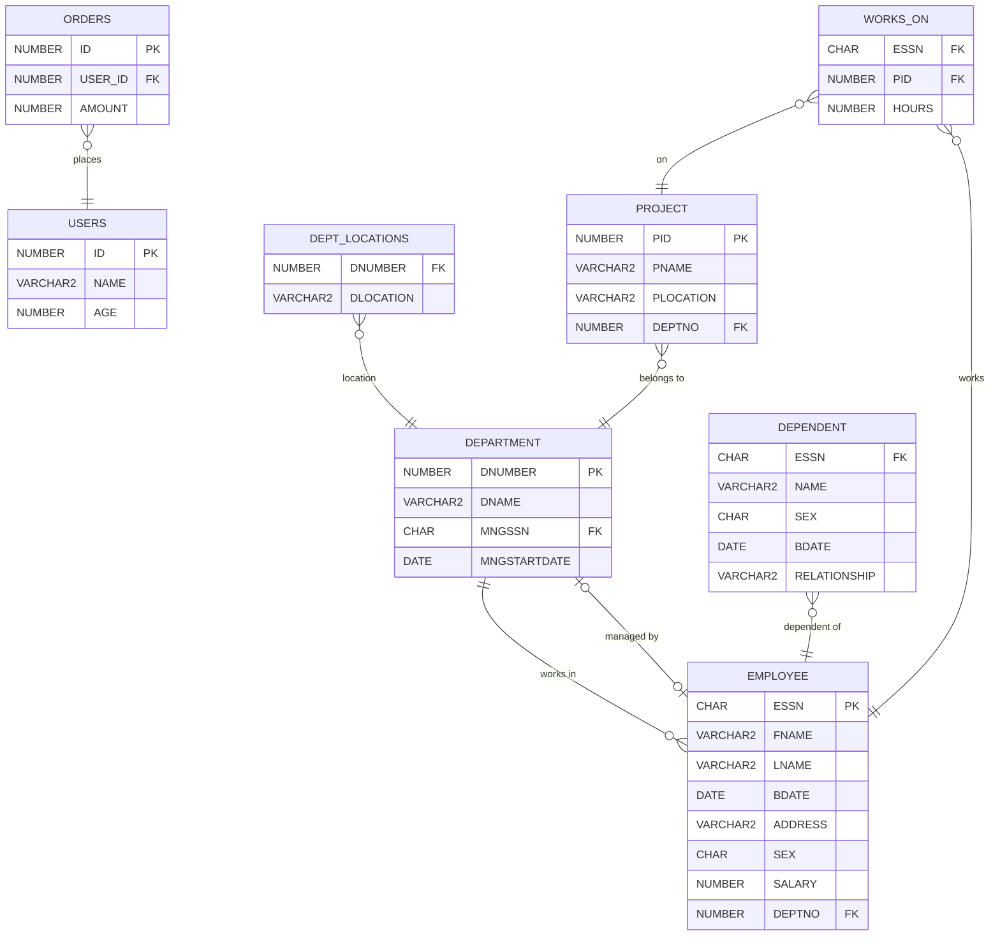

# 🏢 Şirket & İK Yönetim Sistemi Veritabanı

Oracle SQL ile geliştirilmiş kurumsal bir insan kaynakları veritabanı şeması. Çalışan, departman, proje ve sipariş yönetimini kapsar.

## 📋 Tablolar

| Tablo | Açıklama |
|---|---|
| `USERS` | Sisteme kayıtlı kullanıcılar |
| `DEPARTMENT` | Şirket departmanları ve yöneticileri |
| `EMPLOYEE` | Çalışan bilgileri |
| `DEPT_LOCATIONS` | Departman lokasyonları |
| `PROJECT` | Projeler ve atandıkları departmanlar |
| `DEPENDENT` | Çalışanların bakmakla yükümlü oldukları kişiler |
| `WORKS_ON` | Çalışan-Proje atamaları |
| `ORDERS` | Kullanıcı siparişleri |

## 🗺️ ER Diyagramı



## ⚙️ Kurulum

### Gereksinimler
- Oracle Database (19c veya üzeri önerilir)
- Oracle SQL Developer veya SQL*Plus

### Çalıştırma Sırası

> ⚠️ Önce `schema.sql`, sonra `data.sql` çalıştırılmalıdır.

```bash
# SQL*Plus ile
@schema.sql
@data.sql
```

SQL Developer kullanıyorsanız dosyaları sırasıyla açıp **F5** ile çalıştırın.

## 🗂️ Dosya Yapısı

```
├── schema.sql   # Tablo tanımları, FK'lar, View, Trigger, Procedure
└── data.sql     # Örnek test verileri
```

## 🛠️ Şema Nesneleri

### View — `V_EMPLOYEE_REPORT`
Çalışanların departman, maaş, bakmakla yükümlü sayısı ve toplam çalışma saati bilgilerini getiren rapor görünümü.

### Trigger — `TRG_CHECK_SALARY`
Bir çalışanın maaşının 2000 birimin altına düşmesini engeller.

### Procedure — `PR_GIVE_RAISE`
Belirtilen departmandaki tüm çalışanlara yüzde bazlı zam uygular.

```sql
-- Kullanım örneği: 1 numaralı departmana %10 zam
EXEC PR_GIVE_RAISE(1, 10);
```

## 👤 Yazar

**Yusuf Koyuncu** — 2026
