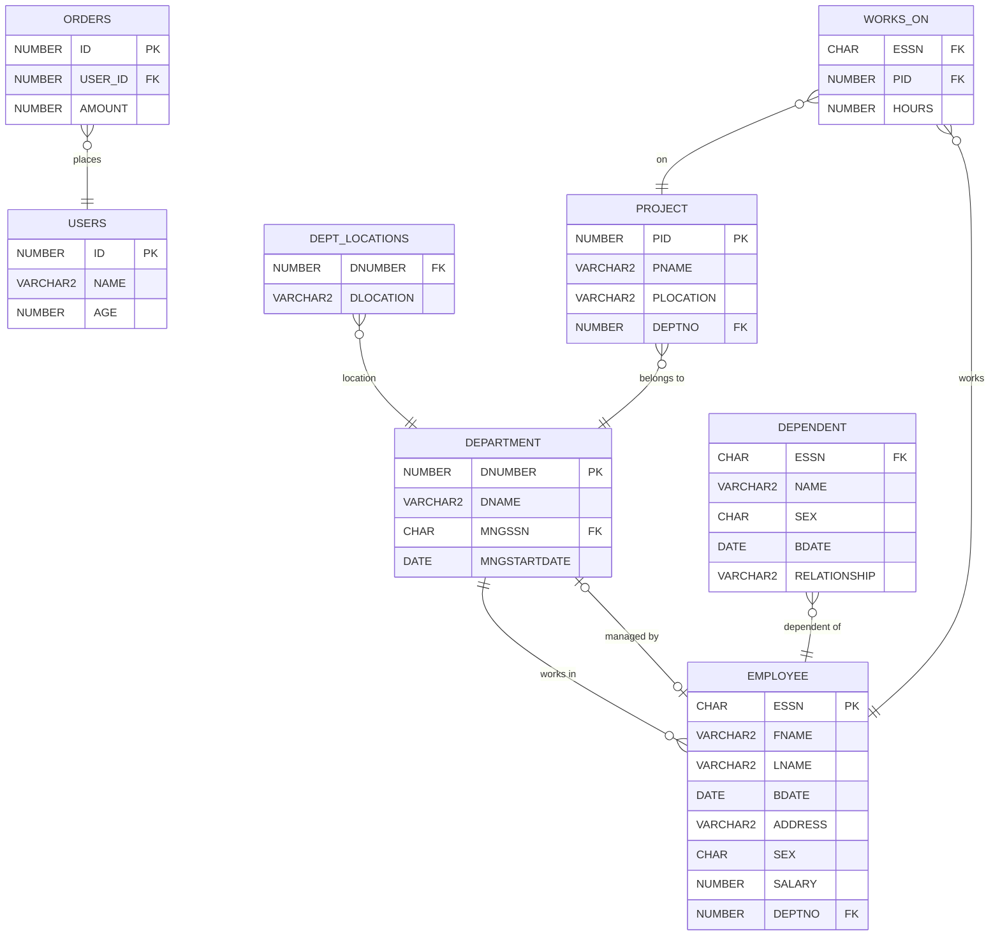

# 🏢 Company HR Management System

An Oracle SQL schema for a company's human resources data. It covers employees, departments, projects, dependents and user orders.


## 📋 Tables

| Table | Description |
|---|---|
| `USERS` | Registered users |
| `DEPARTMENT` | Company departments and their managers |
| `EMPLOYEE` | Employee information |
| `DEPT_LOCATIONS` | Department locations |
| `PROJECT` | Projects and the departments they belong to |
| `DEPENDENT` | People dependent on each employee |
| `WORKS_ON` | Employee-to-project assignments |
| `ORDERS` | User orders |

## 🗺️ ER diagram


```mermaid
erDiagram
    USERS {
        NUMBER ID PK
        VARCHAR2 NAME
        NUMBER AGE
    }
    DEPARTMENT {
        NUMBER DNUMBER PK
        VARCHAR2 DNAME
        CHAR MNGSSN FK
        DATE MNGSTARTDATE
    }
    EMPLOYEE {
        CHAR ESSN PK
        VARCHAR2 FNAME
        VARCHAR2 LNAME
        DATE BDATE
        VARCHAR2 ADDRESS
        CHAR SEX
        NUMBER SALARY
        NUMBER DEPTNO FK
    }
    DEPT_LOCATIONS {
        NUMBER DNUMBER FK
        VARCHAR2 DLOCATION
    }
    PROJECT {
        NUMBER PID PK
        VARCHAR2 PNAME
        VARCHAR2 PLOCATION
        NUMBER DEPTNO FK
    }
    DEPENDENT {
        CHAR ESSN FK
        VARCHAR2 NAME
        CHAR SEX
        DATE BDATE
        VARCHAR2 RELATIONSHIP
    }
    WORKS_ON {
        CHAR ESSN FK
        NUMBER PID FK
        NUMBER HOURS
    }
    ORDERS {
        NUMBER ID PK
        NUMBER USER_ID FK
        NUMBER AMOUNT
    }

    EMPLOYEE }o--|| DEPARTMENT : "works in"
    DEPARTMENT |o--o| EMPLOYEE : "managed by"
    DEPT_LOCATIONS }o--|| DEPARTMENT : "location"
    PROJECT }o--|| DEPARTMENT : "belongs to"
    DEPENDENT }o--|| EMPLOYEE : "dependent of"
    WORKS_ON }o--|| EMPLOYEE : "works"
    WORKS_ON }o--|| PROJECT : "on"
    ORDERS }o--|| USERS : "places"
```

## 🛠️ Schema objects

### View: `V_EMPLOYEE_REPORT`
A report view with each employee's department, salary, number of dependents and total working hours.

### Trigger: `TRG_CHECK_SALARY`
Prevents an employee's salary from dropping below 2000.

### Procedure: `PR_GIVE_RAISE`
Applies a percentage raise to every employee in a department.

```sql
-- Example: give department 1 a 10% raise
EXEC PR_GIVE_RAISE(1, 10);
```

## ⚡ Performance and data integrity

**B-tree indexes** speed up joins and filters:

| Index | Purpose |
|---|---|
| `idx_employee_dept` | Department-based reports and joins |
| `idx_project_location` | Filtering projects by location |
| `idx_department_name` | Looking up departments by name |
| `idx_orders_user` | Joining orders to users |

**CHECK constraints** keep the data valid at the database level, together with primary keys, foreign keys and `NOT NULL` rules:

- `CK_SALARY`: salary must be at least 2000
- `CK_SEX`: sex must be `M`, `F` or `O`
- `CK_HOURS`: working hours must be between 0 and 40

The end of `schema.sql` also contains a commented-out example of a role-based access setup (`HR_MANAGER`). It is only a sketch and is not applied.

## ⚙️ Setup

### Requirements
- Oracle Database (19c or later recommended)
- Oracle SQL Developer or SQL*Plus

### Run order

> ⚠️ Run `schema.sql` first, then `data.sql`.

```bash
# with SQL*Plus
@sql/schema.sql
@sql/data.sql
```

In SQL Developer, open the files in that order and run each one with **F5**.

## 🗂️ Files

* 📄 **[sql/schema.sql](./sql/schema.sql)**: tables, foreign keys, view, trigger, procedure, indexes and constraints
* 📄 **[sql/data.sql](./sql/data.sql)**: sample test data

## 👤 Author

**Yusuf Koyuncu**, 2026
